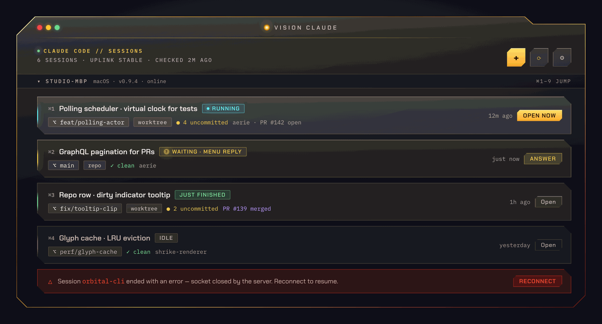
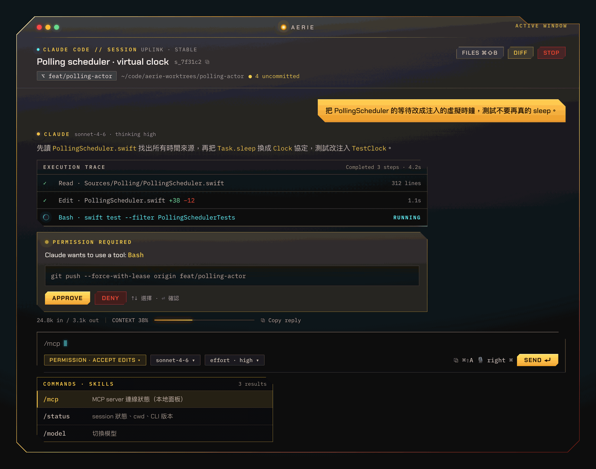
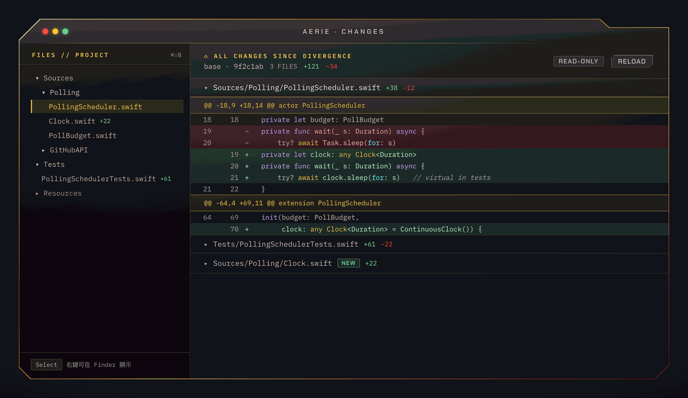
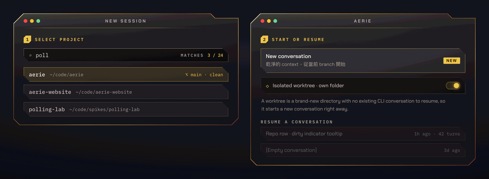
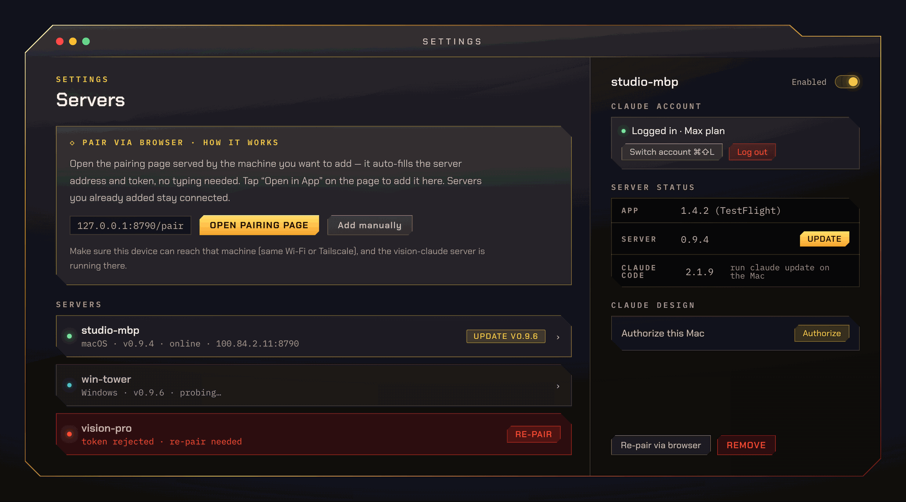
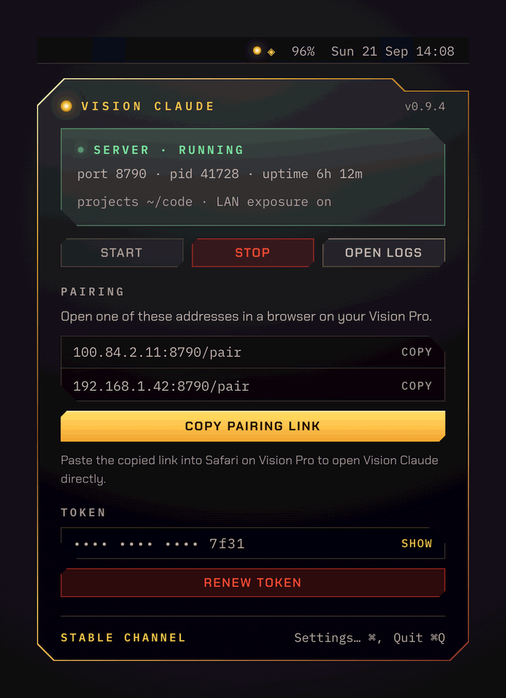

# vision-claude

Run Claude Code on your Mac or Windows PC, drive it from a native Mac app or from Vision Pro.

## Install

Three pieces, one line each. Pick the ones for what that machine should do — a Mac can be both a server and an app.

| Role | Command |
|---|---|
| Mac server + menu bar app | `curl -fsSL https://raw.githubusercontent.com/echoulen/vision-claude-macos/main/install.sh \| bash -s -- --server` |
| Mac / Vision Pro app | `curl -fsSL https://raw.githubusercontent.com/echoulen/vision-claude-macos/main/install.sh \| bash -s -- --app` |
| Windows server | `irm https://raw.githubusercontent.com/echoulen/vision-claude-macos/main/install.ps1 \| iex` |

Nothing to clone, no Node or Xcode required. On Vision Pro the app comes from TestFlight.

## First run

1. **Pair.** When a server install finishes it prints a pairing URL — `http://127.0.0.1:8790/pair` on a Mac, `http://<PC's LAN IP>:8790/pair` on Windows. Open it in a browser on the Mac (or Vision Pro, using the server's LAN IP) and click **Open in App**; the address and token are handed over, nothing to type. You can also grab the link any time from the menu bar app (Mac) or the tray app (Windows). Each device pairs once; the app can stay connected to several servers at once.
2. **Start a session.** Press **⌘N**, pick a project folder, and type. Each session is its own window and keeps running in the background.

<details>
<summary>Keyboard shortcuts</summary>

| | |
|---|---|
| `⌘N` | New session |
| `⌘0` | Session list |
| `⌘1`–`⌘9` | Jump to a session |
| `⌥⌘V` | Bring Vision Claude to front from any app |
| `⌘⇧G` | Tile all windows |
| `⌘⇧←` / `⌘⇧→` | Focus the window to the left / right |
| `⌘,` | Settings |

</details>

## Screenshots

*Design renders from the UI mockup — this is what the app looks like.*

Every session is one Claude Code conversation bound to a folder, on any server you've paired.



Chat with tool calls, thinking and streaming output inline.



Review the diff Claude just wrote without leaving the window.



Start a session: pick a server, a project folder and a branch or worktree.



Pair and manage every server — Mac or Windows — from the app's settings.



On a Mac the server lives in the menu bar — status, pairing link, logs, updates; on Windows the same panel lives in the system tray.



**[Full UI design showcase →](https://echoulen.github.io/vision-claude-macos/)**

## Updates

The app updates itself from **Settings → App**. Each server updates from the app's **Settings → Servers**, or on that machine from the menu bar app (Mac) or the tray app (Windows). The Vision Pro app updates through TestFlight.

<details>
<summary>Requirements and uninstall</summary>

**Requirements** — a Mac with Apple Silicon; the Claude Code CLI installed and logged in on whichever machine runs the server (the app alone doesn't need it). For a Windows server: Windows 10 1803+ / Windows 11, 64-bit, on a network set to **Private**; Git for Windows and Claude Code are installed for you if missing.

**Uninstall on macOS** (removes the server, the menu bar app and the Mac app, keeping `~/.vision-claude/`):

```bash
curl -fsSL https://raw.githubusercontent.com/echoulen/vision-claude-macos/main/install.sh | bash -s -- --uninstall
```

**Uninstall on Windows** (in a normal PowerShell window; keeps `%USERPROFILE%\.vision-claude\`):

```powershell
& ([scriptblock]::Create((irm https://raw.githubusercontent.com/echoulen/vision-claude-macos/main/install.ps1))) -Uninstall
```

This repo is the public distribution channel — installers and release builds only; the source lives in a private repo. `install.sh`, `install.ps1`, this README and `images/` are mirrored here on each release, so don't edit them here.

</details>
